# LLM-Training

## 预训练 [Pre-training]

Pre-training的思路很简单，就是输入一堆文本，让模型做 `Next Token Prediction` 的任务。

现在主要来讨论几种预训练过程中所用到的方法：`数据源采样`、`数据预处理`、`模型结构`。

### 数据源采样

在 [gpt3](https://arxiv.org/pdf/2005.14165.pdf) 的训练过程中，存在多个训练数据源，论文中提到：对不同的数据源会选择不同采样比例：


通过「数据源」采样的方式，能够缓解模型在训练的时候受到「数据集规模大小」的影响。

从上图中可以看到，相对较大的数据集（Common Crawl）会使用相对较大的采样比例（60%），这个比例远远小于该数据集在整体数据集中所占的规模（410 / 499 = 82.1%），因此，CC 数据集最终实际上只被训练了 0.44 个 epoch。

而对于规模比较小的数据集（Wikipedia），则将多被训练几次（3.4 个 epoch）。

这样一来就能使得模型不会太偏向于规模较大的数据集，从而失去对规模小但作用大的数据集上的学习信息。

#### Gemini 消融实验

数据混合比例通过较小的模型进行消融实验，以平衡有用性指标（如遵循指示，创造力）和减少模型伤害，并且这些结果可以很好地推广到较大的模型。

### 数据清洗

通常来讲，处理互联网数据集都包含以下几步：

1. 语言识别：判断文章的语言类型，在 [LLaMA](https://arxiv.org/pdf/2302.13971.pdf) 的数据预处理中过滤掉了 `Common Crawl` 中所有的非英文语料。
2. 规则过滤：用规则过滤掉那些低质内容，例如：同一句话中出现过多标点符号、或包含一些违禁词等。
3. 基于打分模型的内容过滤：通过训练一个轻量的机器学习模型，用于判断一篇文章是否足够优质。
4. 文章去重：去掉一些相似内容的文章，通常分为：`确定性去重`（命中一些明确的公共子串或模板） 和 `模糊性去重`（将文档进行嵌入，通过哈希的方法进行去重，比如局部敏感哈希MinHash、SimHash等方法去重）。如果去重没有做好，模型在这样的语料上进行学习后就会更倾向于记忆，导致泛化能力差。


以下基于 [Falcon Paper](https://arxiv.org/pdf/2306.01116.pdf) 讲述如何对数据处理的过程。

- 语言识别（过滤掉非英语的语料）

  作者使用 [fastText](https://github.com/facebookresearch/fastText) 训练了一个语言识别模型，去掉那些英语得分低于 0.65 的文章，这类低质文章主要包括：非英语文章、以及那些不是由自然语言构成的网页（比如一些纯图像的博客和广告）。

- 低质量过滤
  
  【文章级别过滤】
   > 首先，去除一些文章内一直重复同一段内容的文章，以及一些包含错误信息的文章（例如抓取超时等）；其次，对每一篇文章，通过判断文章整体长度、标点符号占文章长度的比例等，来过滤掉那些不正规的文章；

  【句子级别过滤】
   > 过滤掉文章中的一些无用的句子；
    1. 句子中主要由大写字符组成（丢弃）
    2. 句子由纯数字组成（丢弃）
    3. 命中特定关键词（丢弃）
    4. 如果句子长度小于 10，且命中以下模版：
       * 句子以（登录、注册）开头。
       * 句子以（展开、更多）结尾。
 
    如果一个文档中 5% 的行都被过滤了之后，那么整个文档也不要了。

    **NOTE**: 尽管通过训练模型可以加快速度，但考虑到模型训练会出现输出偏好，所以依旧保持使用`规则`来清理数据。

### 模型结构

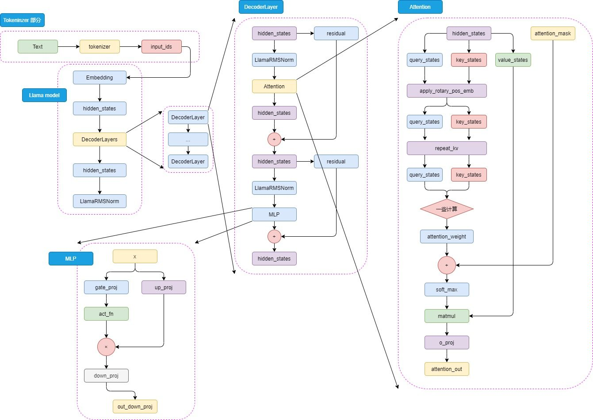

#### 位置编码 Positional Embedding

目前主流的 Attention 计算公式如下:

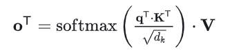

我们会发现，在未加入位置信息的情况下，无论 q 和 k 所处的位置如何变化，它们之间的注意力权重都不会发生变化，也就是位置无关。

但是在一个句子里，各个词的前后关系对这个句子的意义是有影响的，这种影响不仅体现在语法方面，而且还体现在语义方面。

当一个序列输入进一个自注意力模块时，由于序列中所有的 Token 是同时进入并被处理的，如果不提供位置信息，那么这个序列的相同的 Token 对自注意力模块来说就不会有语法和语义上的差别，他们会产生相同的输出。

所以，我们需要给自注意力模块加入位置编码信息。

目前大语言模型都倾向于使用`相对位置编码`，而不是绝对位置编码。比较直观的是，一个词语和其附近词语相关性高的概率偏大，在 Transformer 架构中，向量 q 和其相邻的向量 k 之间 注意力分数 应该偏高。

##### 旋转式位置编码 RoPE

旋转位置编码RoPE (Rotary Position Embedding) 是目前大模型中广泛使用的一种位置编码，包括但不限于Llama、Baichuan、ChatGLM、Qwen等。

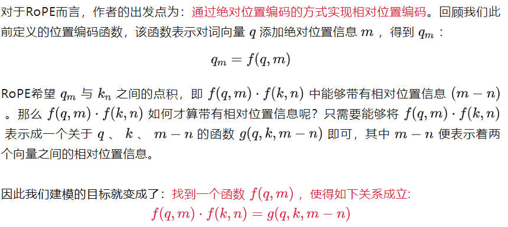

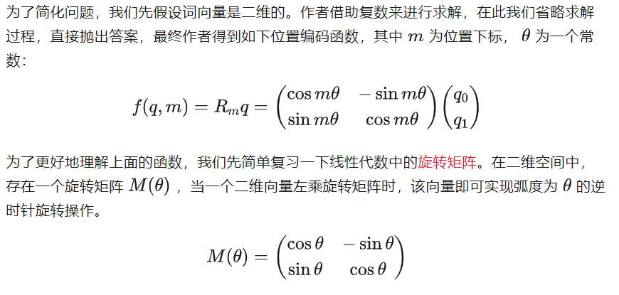

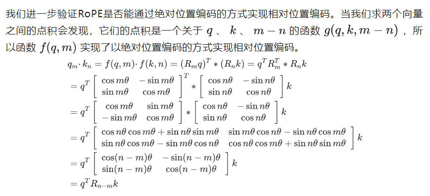

这意味着只需要将向量旋转某个角度，即可实现对该向量添加绝对位置信息，这就是旋转位置编码的由来。


##### 模型外推性

外推性是指大模型在训练时和预测时的输入长度不一致，导致模型的泛化能力下降的问题。例如，如果一个模型在训练时只使用了 512 个 token 的文本，那么在预测时如果输入超过 512 个token，模型可能无法正确处理。这就限制了大模型在处理长文本或多轮对话等任务时的效果。

### Tokenizer 分词

> 词汇的设计显著影响训练效率和下游任务的表现

基于词（Word）的切分，会造成:
- 词表规模过大
- 一定会存在UNK，造成信息丢失
- 不能学习到词缀之间的关系，例如：dog与dogs，happy与unhappy

基于字符（Char）的切分，会造成:
- 每个 token 的信息密度低，英文中尤为明显，但中文却是较为合理
- 序列过长，解码效率很低

基于子词（subword）的切分可以实现：
- 词表规模适中，解码效率较高
- 能学习到词缀之间的关系

#### BPE (Byte-Pair Encoding)

Byte-Pair Encoding (BPE)是最广泛采用的 subword 分词器。目前主流的大模型都是采用 BPE 分词，例如`Baichuan/2`、`Qwen`、`LLama/2`、`GPT3.5/4`、`Gemini`。

BPE分词分为训练阶段和推理阶段。

##### 训练阶段

在训练阶段中，目标是给定语料，通过训练算法，生成`合并规则`和`词表`。从一个字符级别的词表为基础，合并 pair 并添加到词表中，逐步形成大词表。合并规则为选择相邻 pair 词频最大的进行合并。

```python
corpus = [
    "This is the Hugging Face Course.",
    "This chapter is about tokenization.",
    "This section shows several tokenizer algorithms.",
    "Hopefully, you will be able to understand how they are trained and generate tokens.",
]

small_vocab = ['i', 't', 'p', 'o', 'r', 'm', 'e', ',', 'y', 'v', 'Ġ', 'F', 'a', 'C', 'H', '.', 'f', 'l', 'u', 'c', 'T', 'k', 'h', 'z', 'd', 'g', 'w', 'n', 's', 'b']
```

基于小词表就可以对每个整词进行切分：

```
'This': ['T', 'h', 'i', 's'], 
'Ġis': ['Ġ', 'i', 's'], 
'Ġthe': ['Ġ', 't', 'h', 'e'], 
...
'Ġand': ['Ġ', 'a', 'n', 'd'], 
'Ġgenerate': ['Ġ', 'g', 'e', 'n', 'e', 'r', 'a', 't', 'e'], 
'Ġtokens': ['Ġ', 't', 'o', 'k', 'e', 'n', 's']
```

对每个整词进行`2-gram`，统计相邻两个 pair 的词频：
```python
{('T', 'h'): 3, ('h', 'i'): 3, ('i', 's'): 5, ('Ġ', 'i'): 2, ('Ġ', 't'): 7, ('t', 'h'): 3, ..., ('n', 's'): 1}
```

统计当前频率最高的相邻pair，经过统计，当前频率最高的pair为: ('Ġ', 't')， 频率为 7 次。将 ('Ġ', 't') 合并成一个词并添加到词表中。同时在`合并规则`中添加 (‘Ġ’, ‘t’) 这条合并规则。

此时的vocab词表更新成:
```python
['i', 't', 'p', 'o', 'r', 'm', 'e', ',', 'y', 'v', 'Ġ', 'F', 'a', 'C', 'H', '.', 'f', 'l', 'u', 'c', 'T', 'k', 'h', 'z', 'd', 'g', 'w', 'n', 's', 'b', 
'Ġt']
```

重新对每个整词进行切分：
```
{'This': ['T', 'h', 'i', 's'], 
'Ġis': ['Ġ', 'i', 's'], 
'Ġthe': ['Ġt', 'h', 'e'], 
'ĠHugging': ['Ġ', 'H', 'u', 'g', 'g', 'i', 'n', 'g'],
...
'Ġtokens': ['Ġt', 'o', 'k', 'e', 'n', 's']}
```

可以看到新切分的整词已经包含了新的词`Ġt`。重复上述循环直到整个词表的大小达到预先设定的词表大小下一个最高频的 pair 出现频率为1。

假设最终的结果如下所示：
```python
vocabs = ['i', 't', 'p', 'o', 'r', 'm', 'e', ',', 'y', 'v', 'Ġ', 'F', 'a', 'C', 'H', '.', 'f', 'l', 'u', 'c', 'T', 'k', 'h', 'z', 'd', 'g', 'w', 'n', 's', 'b', 'Ġt', 'is', 'er', 'Ġa', 'Ġto', 'en', 'Th', 'This', 'ou', 'se', 'Ġtok', 'Ġtoken', 'nd', 'Ġis', 'Ġth', 'Ġthe', 'in', 'Ġab', 'Ġtokeni', 'Ġtokeniz']

merge_rules = [('Ġ', 't'), ('i', 's'), ('e', 'r'), ('Ġ', 'a'), ('Ġt', 'o'), ('e', 'n'), ('T', 'h'), ('Th', 'is'), ('o', 'u'), ('s', 'e'), ('Ġto', 'k'), ('Ġtok', 'en'), ('n', 'd'), ('Ġ', 'is'), ('Ġt', 'h'), ('Ġth', 'e'), ('i', 'n'), ('Ġa', 'b'), ('Ġtoken', 'i'), ('Ġtokeni', 'z')]
```

##### 推理阶段

在推理阶段，给定一个句子，需要将其切分成 token 的序列。具体实现上需要先对句子进行预分词并切分成字符级别的序列，然后顺序根据合并规则进行合并。

```python
def tokenize(self, text: str) -> List[str]:
    # pre tokenize
    words = [word for word, _ in self.pre_tokenize_str(text)]
    # split into char level
    splits = [[c for c in word] for word in words]
    # apply merge rules
    for merge_rule in self.merge_rules:
        for index, split in enumerate(splits): #处理每一个单词，split:['T', 'h', 'i', 's']
            i = 0
            while i < len(split) - 1:
                if split[i] == merge_rule[0] and split[i + 1] == merge_rule[1]:
                    split = split[:i] + ["".join(merge_rule)] + split[i + 2:]
                else:
                    i += 1
            splits[index] = split
    return sum(splits, [])  # 合并成一个List
```

举例如下：
```shell
>>> tokenize("This is not a token.")
>>> ['This', 'Ġis', 'Ġ', 'n', 'o', 't', 'Ġa', 'Ġtoken', '.']
```

~10-100k possible tokens

1 token ~= `0.75` of word


**NOTE**：解码过程不是简单地将 token IDs 映射回 tokens，还需要合并那些被分为多个 token 的单词。


## 指令微调 [Instruction Tuning]


### 为什么要指令微调？

由于预训练 Pre-training 任务的本质在于「续写」，这样预训练得到的大预言模型可以保存很多知识，但是可能无法充分利用这些知识来回答问题。而「续写」的方式可能无法充分利用这些知识很好地回答用户的问题。

例如：

| 用户问题 | 用于预期回答 | 模型续写结果 |
| :---: | :---: | :---: |
| 《无间道》的主演有哪些？| 刘德华、梁朝伟 | 《无间道》的主演有哪些？</br>不少观众期待看到阵容公告，今天小编... |

因为训练大多来自互联网中的数据，我们无法保证数据中只存在存在规范的「一问一答」格式，这就会造成预训练模型通常无法直接给出人们想要的答案。

但是，这并不代表预训练模型「无知」，只是需要我们用一些巧妙的「技巧」来引导出答案：

| 用户问题 | 用于预期回答 | 模型续写结果 |
| :---: | :---: | :---: |
| 《无间道》的主演有 | 刘德华、梁朝伟 | 《无间道》的主演有刘德华、梁朝伟和黄秋生，</br>而这部电影也是香港警匪片的代表作之一。 |

既然模型知道这些知识，只是不符合我们人类的对话习惯，那么我们要去教会模型「如何对话」，这就是「指令对齐」（Alignment）挖掘大模型的潜力。

### 什么是指令微调？

指令微调是指通过构建指令格式的实例，然后以`有监督`的方式对大语言模型进行微调。

指令格式通常包含任务描述（被称为指令`instruction`），一对输入输出以及少量示例（可选）。

例如，“请回答以下问题：中国的首都是哪个城市？”，回答：“中国的首都是北京”，其中“请回答以下问题：”是任务描述，“中国的首都是哪个城市？”是输入，“中国的首都是北京”是输出。

又比如“请将英文翻译为中文，输入示例：The capital city of China is Beijing，输出示例：中国的首都是北京。请翻译：Which city is the capital of US?”，回答：“美国的首都是哪个城市？”，这里就多一个示例，这有助于大模型理解任务。

指令微调可以帮助 LLM 拥有更好的推理能力， 从而展现出`泛化`到未见过任务的卓越能力。

### 微调数据集


- 格式化已有数据集
  > 将传统的NLP数据集格式调整后，用于指令微调。
- 人工标注数据集
  > 为获得更好的人类对齐效果，OpenAI 建议使用人工标注数据集。
  为降低人工标注成本，目前很多数据集由 ChatGPT 生成，包括用户分享的 ChatGPT 对话历史（如 ShareGPT）或者使用 ChatGPT生成的数据集。

典型的数据集格式：`{"instruction": "", "input": "", "output": ""}`

对话微调是一种特殊的指令微调。其目的是让大语言模型在「补全」能力的基础上，解锁「对话」能力。其数据集格式：`{"instruction": "", "input": "", "output": "", "history": [{"", ""}, {"", ""}]}`

OpenAI推出了 ChatML 格式，其原始数据格式为：
```
Prompt: """<|im_start|>system
You are ChatGPT, a large language model trained by OpenAI. Answer as concisely as possible.
Knowledge cutoff: 2021-09-01
Current date: 2023-03-01<|im_end|>
<|im_start|>user
How are you<|im_end|>
<|im_start|>assistant
I am doing well!<|im_end|>
<|im_start|>user
How are you now?<|im_end|>"""

Complete: """{output}"""
```

NOTE：Baichuan2大模型使用 `100k` 样本进行指令微调。

### 参数微调方法 [Parameter-Efficient Fine-Tuning, PEFT]

虽然指令微调相比于预训练更加高效（只需要处理微调数据集），但是全参数的指令微调依然需要消耗较多的算力。

目前有多种高效参数微调方案，可以在实现和全参数微调相同性能的情况下，大幅降低微调成本。

PEFT方法可以分为三类，不同的方法对模型的不同部分进行下游任务的适配：

- Prefix/Prompt-Tuning：在模型的输入或隐层添加 k 个额外可训练的前缀 tokens（这些前缀是连续的伪 tokens，不对应真实的 tokens），只训练这些前缀参数；
- Adapter-Tuning：将较小的神经网络层或模块插入预训练模型的每一层，这些新插入的神经模块称为 adapter（适配器），下游任务微调时也只训练这些适配器参数；
- LoRA：通过学习小参数的低秩矩阵来近似模型权重矩阵 W 的参数更新，训练时只优化低秩矩阵参数。

### 开源数据集整理

目前通用的中文微调数据集有：

| 数据集 | 内容 |
| :---: | :---: |
| [COIG](https://huggingface.co/datasets/BAAI/COIG) |	Chinese Open Instruction Generalist project |
[Stanford Alpaca (Chinese)](https://github.com/ymcui/Chinese-LLaMA-Alpaca)	| Alpaca 数据集中文翻译（ChatGPT 辅助翻译）|
[BELLE](https://huggingface.co/datasets/BelleGroup/train_2M_CN)	| BELLE 项目的中文数据集（ChatGPT[text-davinci-003] 生成）|
[GuanacoDataset](https://huggingface.co/datasets/JosephusCheung/GuanacoDataset)	| Guannaco 模型的对话数据集 |
[WebQA(zh)](https://huggingface.co/datasets/suolyer/webqa)	| 中文网络问答 |
[pCLUE](https://github.com/CLUEbenchmark/pCLUE)	| 基于提示的大规模预训练数据集，用于多任务学习和零样本学习 |
| [CSL](https://github.com/ydli-ai/CSL) | 大规模中文科学文献数据集（2010-2020）|


For supervised fine-tuning:
  - [Stanford Alpaca (en)](https://github.com/tatsu-lab/stanford_alpaca)
  - [Stanford Alpaca (zh)](https://github.com/ymcui/Chinese-LLaMA-Alpaca)
  - [GPT-4 Generated Data (en&zh)](https://github.com/Instruction-Tuning-with-GPT-4/GPT-4-LLM)
  - [Open Assistant (multilingual)](https://huggingface.co/datasets/OpenAssistant/oasst1)
  - [Self-cognition (zh)](data/self_cognition.json)
  - [ShareGPT (zh)](https://huggingface.co/datasets/QingyiSi/Alpaca-CoT/tree/main/Chinese-instruction-collection)
  - [RefGPT (zh)](https://github.com/sufengniu/RefGPT)
  - [Guanaco Dataset (multilingual)](https://huggingface.co/datasets/JosephusCheung/GuanacoDataset)
  - [BELLE 2M (zh)](https://huggingface.co/datasets/BelleGroup/train_2M_CN)
  - [BELLE 1M (zh)](https://huggingface.co/datasets/BelleGroup/train_1M_CN)
  - [BELLE 0.5M (zh)](https://huggingface.co/datasets/BelleGroup/train_0.5M_CN)
  - [BELLE Dialogue 0.4M (zh)](https://huggingface.co/datasets/BelleGroup/generated_chat_0.4M)
  - [BELLE School Math 0.25M (zh)](https://huggingface.co/datasets/BelleGroup/school_math_0.25M)
  - [BELLE Multiturn Chat 0.8M (zh)](https://huggingface.co/datasets/BelleGroup/multiturn_chat_0.8M)
  - [Firefly 1.1M (zh)](https://huggingface.co/datasets/YeungNLP/firefly-train-1.1M)
  - [LIMA (en)](https://huggingface.co/datasets/GAIR/lima)
  - [CodeAlpaca 20k (en)](https://huggingface.co/datasets/sahil2801/CodeAlpaca-20k)
  - [Alpaca CoT (multilingual)](https://huggingface.co/datasets/QingyiSi/Alpaca-CoT)
  - [Web QA (zh)](https://huggingface.co/datasets/suolyer/webqa)
  - [UltraChat (en)](https://github.com/thunlp/UltraChat)
  - [WebNovel (zh)](https://huggingface.co/datasets/zxbsmk/webnovel_cn)

## Reinforcement Learning From Human Feedback [RLHF]

虽然 SFT 已被证明是有效的，但是其泛化和创造性能力可能有限，并且容易过度拟合。RLHF是依据人类反馈优化用强化学习方式训练大语言模型，进一步使模型行为与人类偏好和指令遵循保持一致。

### 奖励模型 [Reward Model]

奖励模型源于强化学习中的奖励函数，能对当前的状态刻画一个分数，来说明这个状态产生的价值有多少。在大语言模型微调中的奖励模型是对输入的问题和答案计算出一个分数。输入的答案与问题匹配度越高，则奖励模型输出的分数也越高。

奖励模型训练的基本思路就是利用基于人类反馈生成的人类偏好数据集，训练出一个奖励函数。利用奖励模型，通过强化学习算法近端策略优化（Proximal Policy Optimization, PPO）迭代地改进原始输入的监督微调 SFT 模型，以改变其内部文本分布以优先考虑人类喜欢的序列。从某种意义上来说，奖励模型是将“人类偏好偏差”引入原始监督微调模型的一种手段。

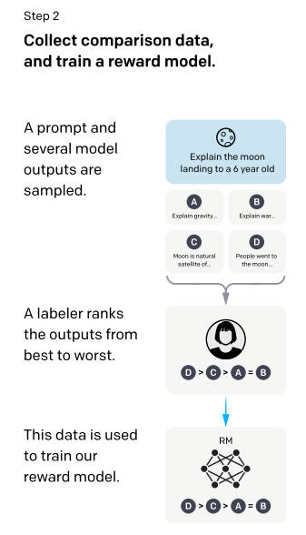

#### 模型架构

奖励模型（RM，也叫偏好模型）将 `SFT` 模型最后一层的 `softmax` 去掉，改成一个线性层。

RM模型的输入是问题和答案，输出是一个标量即评估分数。

#### pairwise ranking loss

由于每个人对问题的答案评分可能都不一样，评分主观性太强，无法使用一个统一的数值对每个答案进行打分。如果采用对答案具体得分回归的方式来训练模型，会造成很大的误差。但是，每个人对答案的好坏排序是基本一致的。通过排序的方式避免了人为的误差。

以下的图来源于Llama2 paper：

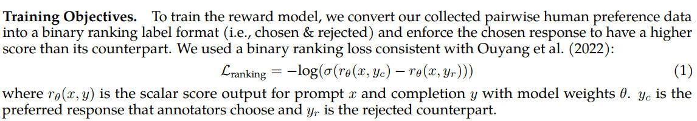

其中，`σ`是 sigmoid 函数，取值范围在(0, 1)。

RM模型的目标是使得排序高的答案 `yc` 对应的标量分数要高于排序低的答案 `yr` ​对应的标量分数，且越高越好，也就是使得损失函数中的 `rθ​(x, yc​) − rθ​(x, yr​)` 这个差值越大越好。通过 sigmoid 函数后，可以看做是一个二分类问题。

#### 开源数据集整理

For reward modelling:
  - [HH-RLHF (en)](https://huggingface.co/datasets/Anthropic/hh-rlhf)
  - [Open Assistant (multilingual)](https://huggingface.co/datasets/OpenAssistant/oasst1)
  - [GPT-4 Generated Data (en&zh)](https://github.com/Instruction-Tuning-with-GPT-4/GPT-4-LLM)

### 强化学习 [Reinforcement Learning]

强化学习（RL）是一种机器学习（ML）技术，可以训练 agent 做出决策，以实现最佳结果。它模仿了人类为实现目标所采取的反复试验的学习过程。

在强化学习过程中，智能体跟环境一直在交互。智能体在环境里面获取到状态，智能体会利用这个状态输出一个动作，一个决策。然后这个决策会放到环境之中去，环境会根据智能体采取的决策，输出下一个状态以及当前的这个决策得到的奖励。智能体的目的就是为了尽可能多地从环境中获取奖励。

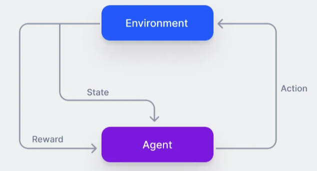

在这里，Agent可以使用 LM 代替，从环境中获取的奖励通过人类反馈得到，如下图所示：

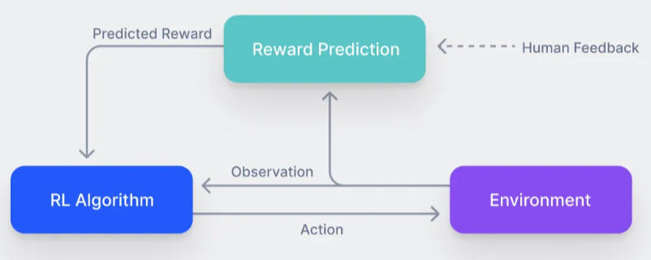

策略（policy）是一个接受提示并返回一系列文本 (或文本的概率分布) 的 LM。这个策略的行动空间 (action space) 是 LM 的词表对应的所有词元 (一般在 50k 数量级) ，观察空间 (observation space) 是可能的输入词元序列，通常也比较大。奖励函数是偏好模型的输出。

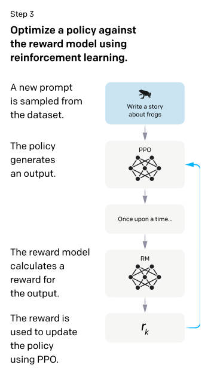

#### Proximal Policy Optimization 近端策略优化

由于输出的奖励本身并不是可微的，所以需要使用强化学习（RL）来构建一个损失函数，以便能够对 LLM 进行反向传播。现在大模型都采用 PPO 算法训练。

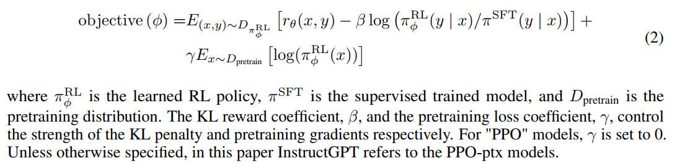

#### 训练 RL 模型

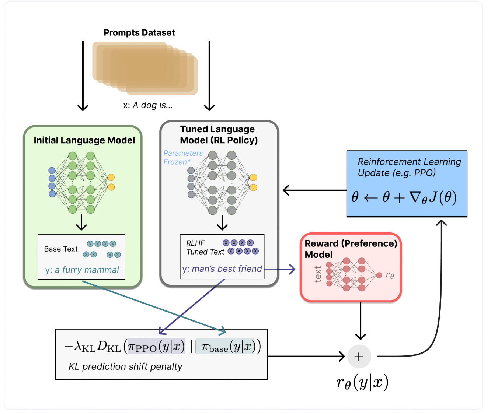

从上图可以看出，将提示 `x` 输入初始 LM 和当前微调的LM，分别得到了输出文本`y1`、`y2`，将来自微调的模型生成的文本传递给 RM 得到一个标量的奖励`rθ`。而初始模型和微调的模型生成的结果会用 `KL散度` 约束它们的分布，确保模型不会太偏离原来的模型，并且能输出高质量的回复。
​

**NOTE**: KL散度（Kullback-Leibler Divergence）是用来度量两个概率分布相似度的指标，若两者差异越小，KL散度越小。

## 参考资料
1. [Llama 模型结构分析](https://flowus.cn/kmno4/share/527055be-464f-4f0f-98c5-8b8f72a1fc2e)
2. [How to train a new language model from scratch using Transformers and Tokenizers](https://huggingface.co/blog/how-to-train)
3. [Common Crawl 数据集](https://commoncrawl.org/get-started)
4. [Tokenizer的系统梳理，并手推每个方法的具体实现](https://cloud.tencent.com/developer/article/2327739)
5. [Hugging Face - 字节对编码标记化](https://huggingface.co/learn/nlp-course/zh-CN/chapter6/5?fw=pt)
6. [BPE 算法原理及使用指南【深入浅出】](https://zhuanlan.zhihu.com/p/448147465)
7. [理解NLP最重要的编码方式 — Byte Pair Encoding (BPE)，这一篇就够了](https://zhuanlan.zhihu.com/p/424631681)
8. [大语言模型（LLM）微调技术笔记](https://github.com/ninehills/blog/issues/92)
9. [github - 指令精调数据](https://github.com/CVI-SZU/Linly/blob/main/instructions/README.md)
10. [State of GPT：大神Andrej揭秘OpenAI大模型原理和训练过程](https://mp.weixin.qq.com/s/zmEGzm1cdXupNoqZ65h7yg)
11. [跟大牛学LLM训练和使用技巧](https://techdiylife.github.io/big-model-training/deepspeed/LLM-state-of-GPT.html)
12. [KL散度(Kullback-Leibler Divergence)介绍及详细公式推导](https://hsinjhao.github.io/2019/05/22/KL-DivergenceIntroduction/)
13. [一文看懂 LLaMA 中的旋转式位置编码（Rotary Position Embedding）](https://zhuanlan.zhihu.com/p/642884818)
14. [图解RoPE旋转位置编码及其特性](https://mp.weixin.qq.com/s/-1xVXjoM0imXMC7DKqo-Gw)
15. [大模型基础｜预训练｜有监督微调SFT](https://zhuanlan.zhihu.com/p/650720185)